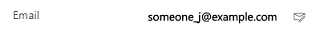
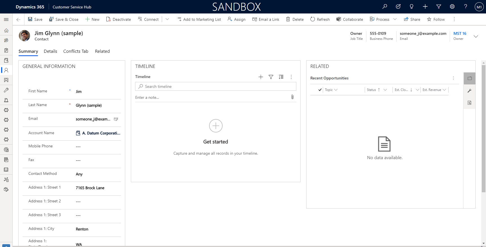
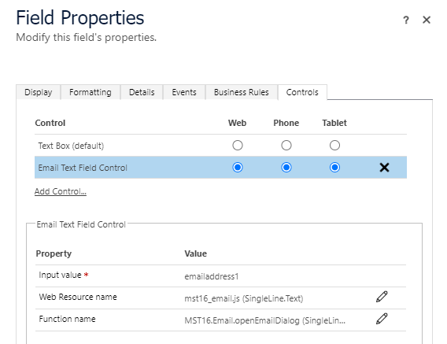

# MST16 PCF Components

This is a repository for [Power Apps component framework](https://docs.microsoft.com/en-us/powerapps/developer/component-framework/overview) controls created by @MST16.

## Email Text Field Control
The control is a clone of OOB Text Field Control for rendering email address with possibility to add a custom action from a web resource.

One of the possible actions can be opening an Email activity record in [Modal Form Dialog](https://powerapps.microsoft.com/en-us/blog/open-a-main-record-in-a-dialog-in-a-model-driven-app/):

### Features
- Same features as OOB Text Field Control
- Custom action for an onClick on 

### Configuration

### Parameters
| Name              | Type                                | Description                                         |
| ----------------- | ----------------------------------- | --------------------------------------------------- |
| Input value       | [SingleLine.Email, SingleLine.Text] | The current field where the control is bounded      |
| Web Resource name | SingleLine.Text                     | Name of a web resource with a custom function       |
| Function name     | SingleLine.Text                     | Full name of a funciton within a web resource above |

# Installation
- Download and install the [latest managed solution](/../../releases/latest)
- Create a web resource with a function on top of `window` object like it's done in [the sample web resource](./EmailTextFieldControl/WebResources/mst16_email.js).
